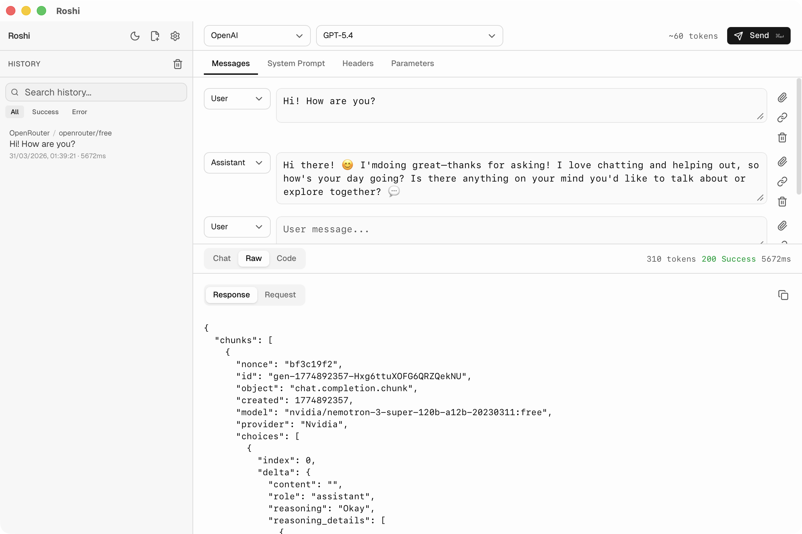
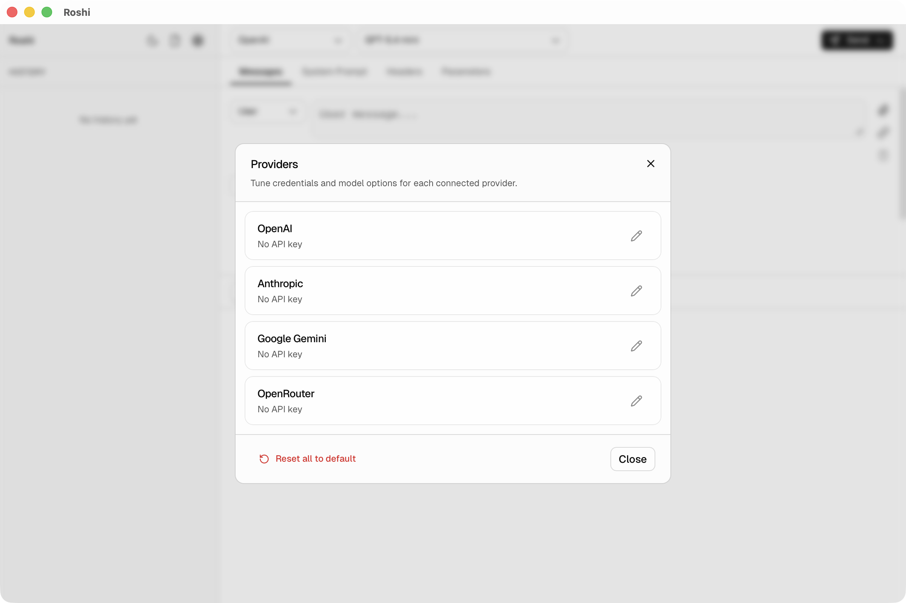
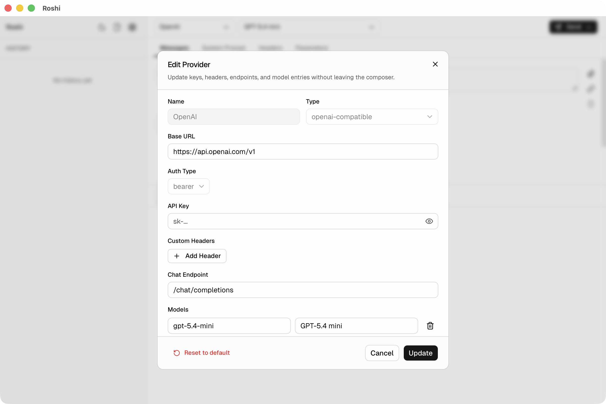

<p align="center">
  
</p>

<h1 align="center">Roshi</h1>

<p align="center">
  <strong>MIT-licensed, local-first API workbench for LLM developers.</strong>
</p>

<p align="center">
  Test OpenAI, Anthropic, OpenRouter, Google Gemini, and custom OpenAI-compatible endpoints with real-time streaming, local history, image inputs, and raw payload inspection.
</p>

<p align="center">
  <a href="https://github.com/andrewmmc/roshi/actions/workflows/ci.yml">
    
  </a>
  <a href="https://github.com/andrewmmc/roshi/releases/latest">
    
  </a>
  <a href="./LICENSE">
    
  </a>
</p>

Roshi is a local-first workspace for testing and debugging LLM APIs. Send prompts, inspect streaming responses, tune model settings, test image inputs, switch between providers, and review raw request and response payloads from one focused interface.

No backend. No account. No telemetry. Your API keys, settings, and request history stay on your machine.

Whether you are debugging prompts, testing custom endpoints, or comparing model behavior, Roshi gives you a dedicated workspace for multi-turn conversations, provider-specific settings, and fast iteration without bending a generic API client into shape.

## Why Roshi

- **Purpose-built for LLM APIs** — test chat-style payloads, streaming, image inputs, and provider-specific settings without forcing them into a generic HTTP client
- **Local-first by default** — no backend, no signup, no telemetry, and no hosted key storage
- **Multi-provider workflow** — built-in templates for OpenAI, Anthropic, Google Gemini, and OpenRouter, plus custom OpenAI-compatible endpoints
- **Debuggable and reproducible** — inspect raw payloads, save local history, and generate Python and Node.js snippets for supported OpenAI-compatible requests

## Screenshots

Real views from the actual app, so you can quickly see how Roshi feels before you download it.

<p align="center">
  
</p>
<p align="center">
  <strong>Compose and iterate fast</strong><br />
  Build multi-turn requests, tune model parameters, and attach images in one focused workspace.
</p>

<table>
  <tr>
    <td width="50%" valign="top">
      
      <p>
        <strong>Inspect responses deeply</strong><br />
        Review streamed output, raw payloads, and generated code while iterating on requests.
      </p>
    </td>
    <td width="50%" valign="top">
      
      <p>
        <strong>Organize providers and history</strong><br />
        Manage models, headers, provider setups, and local request history from one place.
      </p>
    </td>
  </tr>
</table>

## Download

**[Download on the Mac App Store](#)** _(coming soon)_
&nbsp;&nbsp;·&nbsp;&nbsp;
**[Download the latest release](https://github.com/andrewmmc/roshi/releases/latest)** (free, manual updates)

macOS builds are available for both Apple Silicon (M1+) and Intel.

### Mac App Store (recommended)

The Mac App Store version is a one-time purchase that includes automatic updates and supports ongoing development. Click **[Download on the Mac App Store](#)** _(link coming soon)_ to get it.

### Manual install (free, GitHub releases)

1. Download the `.dmg` file from the [releases page](https://github.com/andrewmmc/roshi/releases/latest) for your architecture (Apple Silicon or Intel).
2. Open the `.dmg` and drag **Roshi** to your **Applications** folder.
3. On first launch, macOS may block the app. Go to **System Settings → Privacy & Security** and click **Open Anyway**.
4. Add your API key for any provider in the app and start testing.

> You can also use Roshi as a [web app](#development) in the browser — no install required.

## Features

- **Multi-provider support** — built-in templates for OpenAI, Anthropic, Google Gemini, and OpenRouter; add custom providers for any OpenAI-compatible endpoint
- **Real-time streaming** — SSE streaming with live token output
- **Multi-turn conversations** — build and test full chat sessions with role-based message composer
- **Request history** — every request and response stored locally with search and filtering
- **Code snippets** — auto-generated Python and Node.js snippets for supported OpenAI-compatible requests
- **Image attachments** — test vision models with base64-encoded image inputs
- **Advanced parameters** — temperature, top-p, frequency/presence penalty, max tokens, custom headers, system prompt
- **Dark mode** — toggle between light and dark themes
- **Open source and fully client-side** — MIT licensed, no backend, no telemetry; API keys are stored locally and never transmitted

## Why Developers Can Trust It

- **Open source under MIT** — the code and license are straightforward to inspect, use, and contribute to
- **Privacy-first architecture** — provider keys, settings, and history are stored locally in the app instead of routed through a Roshi service
- **Verified in CI** — every push and pull request runs lint, format checks, tests, and a production build in [CI](https://github.com/andrewmmc/roshi/actions/workflows/ci.yml)
- **No hidden hosted dependency** — the desktop app calls provider APIs directly, and the browser workflow remains client-side for development

## Development

> **Note:** This section is for contributors and developers only. If you just want to use Roshi, [download the app](#download) instead.

### Prerequisites

- Node.js 20+
- [Rust](https://www.rust-lang.org/tools/install) (for Tauri desktop builds)

### Quick start

```bash
npm install
npm run dev          # http://localhost:5173
```

### Commands

```bash
npm run build        # production build
npm run test         # run tests
npm run lint         # ESLint
npm run typecheck    # TypeScript check
npm run format       # Prettier
npm run tauri:dev    # desktop app (dev)
npm run tauri:build  # desktop app (release)
```

### Tech stack

React 19, TypeScript, Vite 7, Tailwind CSS v4, shadcn/ui v4, Zustand, Dexie.js (IndexedDB), eventsource-parser (SSE), Tauri 2 (desktop), Vitest (testing).

See **[AGENTS.md](./AGENTS.md)** for architecture, conventions, and contributor docs.

## Contributing

Issues and pull requests are welcome. If you want to propose a feature, report a bug, or improve a provider workflow, start with [GitHub issues](https://github.com/andrewmmc/roshi/issues) and include enough context to reproduce the behavior.

## Author

Created by **Andrew Mok** ([@andrewmmc](https://github.com/andrewmmc))

## Disclaimer

Roshi is an independent, open-source project. It is not affiliated with, endorsed by, or sponsored by Postman, Inc. "Postman" is a trademark of Postman, Inc. References to Postman are for descriptive purposes only.

## License

[MIT License](LICENSE).
