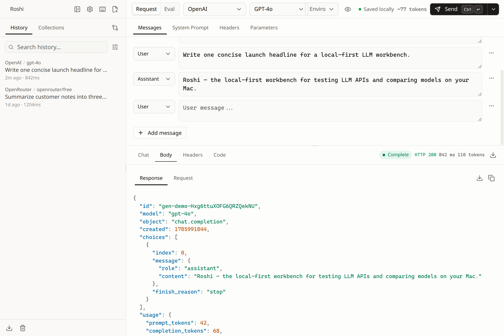
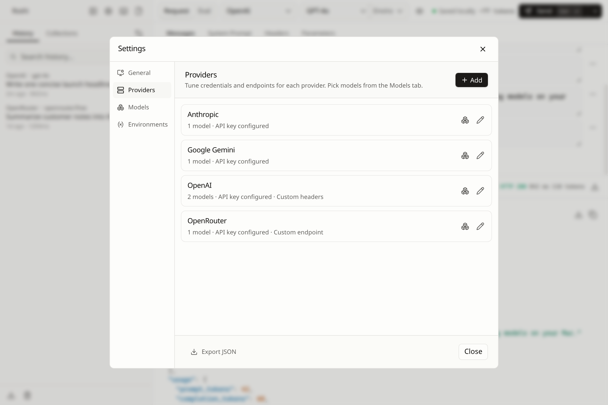
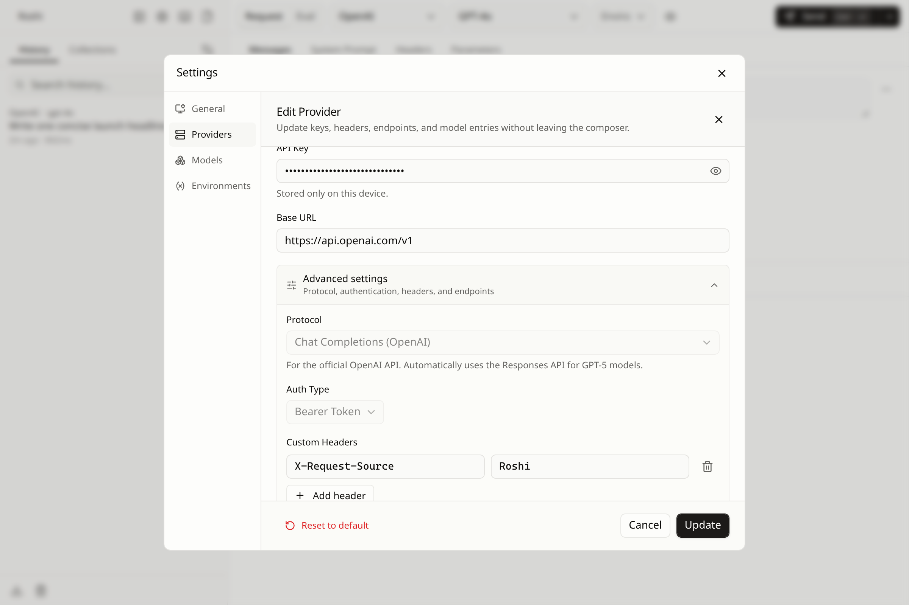
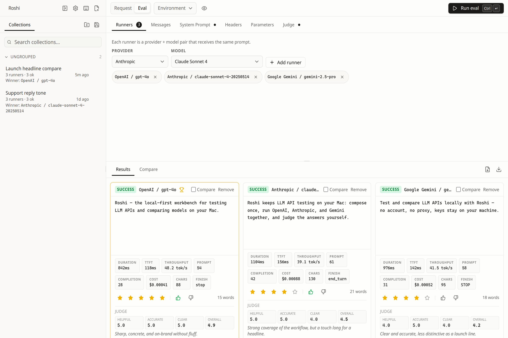
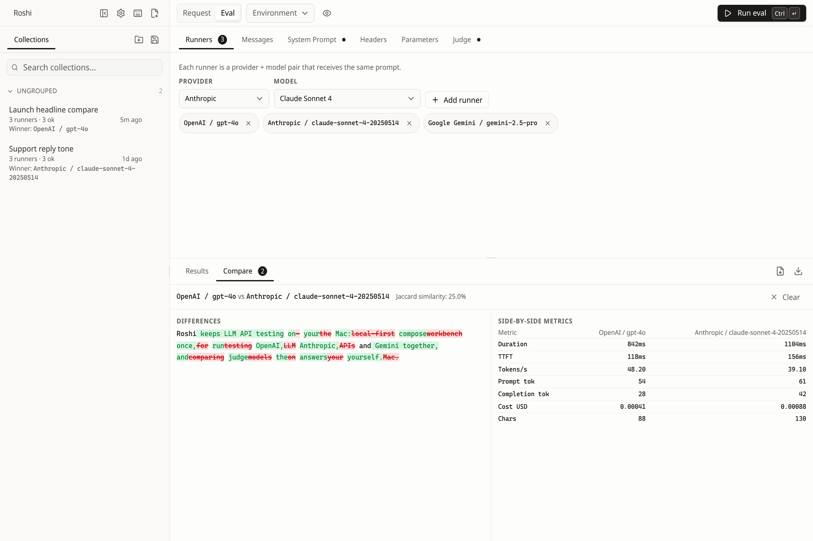
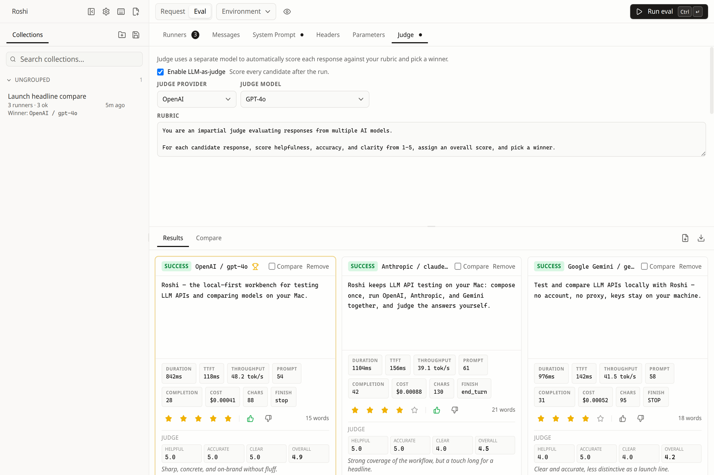

<p align="center">
  
</p>

<h1 align="center">Roshi</h1>

<p align="center">
  <strong>A local-first macOS API client and model evaluation workbench for LLM developers.</strong>
</p>

<p align="center">
  Compose chat requests, inspect complete responses, compare models side by side, and score their output with an LLM judge.
</p>

<p align="center">
  <a href="https://github.com/andrewmmc/roshi/actions/workflows/ci.yml">
    
  </a>
  <a href="https://github.com/andrewmmc/roshi/releases/latest">
    
  </a>
  <a href="./LICENSE">
    
  </a>
</p>

## What is Roshi?

Roshi is a desktop app for developers who build with LLM APIs. If you use Postman or a similar tool for ordinary REST APIs, Roshi is the specialized client for the model layer: it understands multi-turn messages, streaming output, model parameters, token usage, provider-specific payloads, and model comparisons.

Use it to test OpenAI, Anthropic, Google Gemini, OpenRouter, and compatible endpoints without writing a throwaway script for every experiment. Build a request once, inspect exactly what was sent and returned, then run the same prompt across several models and compare quality, latency, token usage, and cost.

Roshi is client-only: there is **no Roshi backend, account, or telemetry**. The desktop app calls providers directly, while your API keys, settings, history, collections, and eval results stay on your Mac.

<p align="center">
  <a href="https://roshi.mmc.dev"><strong>Website</strong></a>
  &nbsp;&nbsp;·&nbsp;&nbsp;
  <a href="https://github.com/andrewmmc/roshi/releases/latest"><strong>Free download</strong></a>
  &nbsp;&nbsp;·&nbsp;&nbsp;
  <a href="https://apps.apple.com/us/app/roshi-llm-api-workbench/id6761768847"><strong>Mac App Store</strong></a>
</p>

## Why Roshi

- **Purpose-built for LLM APIs** — test chat-style payloads, streaming, image inputs, and provider-specific settings without forcing them into a generic HTTP client
- **Local-first by default** — no backend, no signup, no telemetry, and no hosted key storage
- **Multi-provider workflow** — built-in templates for OpenAI, Anthropic, Google Gemini, and OpenRouter, plus custom OpenAI-compatible endpoints
- **Debuggable and reproducible** — inspect raw payloads, save local history with diffing, and generate Python and Node.js snippets for supported OpenAI-compatible requests
- **Compare models side by side** — Eval mode runs the same prompt across multiple providers/models at once, with LLM-as-judge scoring and CSV/JSON export

## How it works

1. **Add a provider** — start from an OpenAI, Anthropic, Gemini, or OpenRouter template, or configure a compatible endpoint.
2. **Compose and debug** — edit messages, images, model parameters, and headers while inspecting streamed text, raw bodies, timing, and token usage.
3. **Compare models** — send the same frozen request to several provider/model pairs and review their output and metrics together.
4. **Evaluate and reuse** — rate responses yourself or apply an LLM judge with your rubric, then save the run, export the results, or generate code.

## Screenshots

These are current views from the shipping app.

<p align="center">
  
</p>
<p align="center">
  <strong>Compose, send, and inspect in one workspace</strong><br />
  Build multi-turn requests, tune parameters and headers, stream the answer, and inspect the complete request or response body.
</p>

<table>
  <tr>
    <td width="50%" valign="top">
      
      <p>
        <strong>Bring your existing providers</strong><br />
        Start with templates for OpenAI, Anthropic, Google Gemini, and OpenRouter, then choose the models you want available.
      </p>
    </td>
    <td width="50%" valign="top">
      
      <p>
        <strong>Configure compatible endpoints</strong><br />
        Control the base URL, protocol, authentication, custom headers, and model list. Credentials are stored locally.
      </p>
    </td>
  </tr>
  <tr>
    <td width="50%" valign="top">
      
      <p>
        <strong>Run one prompt across several models</strong><br />
        Compare output, latency, time to first token, throughput, token counts, estimated cost, ratings, and judge scores.
      </p>
    </td>
    <td width="50%" valign="top">
      
      <p>
        <strong>Inspect differences, not just answers</strong><br />
        Select two results for a word-level diff and a direct comparison of performance and usage metrics.
      </p>
    </td>
  </tr>
</table>

<p align="center">
  
</p>
<p align="center">
  <strong>Apply your own evaluation rubric</strong><br />
  Choose a separate judge model to score candidates for qualities such as helpfulness, accuracy, and clarity, and select a winner.
</p>

## Download

**[Download on the Mac App Store](https://apps.apple.com/us/app/roshi-llm-api-workbench/id6761768847)**
&nbsp;&nbsp;·&nbsp;&nbsp;
**[Download the latest release](https://github.com/andrewmmc/roshi/releases/latest)** (free, manual updates)

macOS builds are available for both Apple Silicon (M1+) and Intel.

### Mac App Store (recommended)

The Mac App Store version is a one-time purchase that includes automatic updates and supports ongoing development. Click **[Download on the Mac App Store](https://apps.apple.com/us/app/roshi-llm-api-workbench/id6761768847)** to get it.

### Manual install (free, GitHub releases)

1. Download the `.dmg` file from the [releases page](https://github.com/andrewmmc/roshi/releases/latest) for your architecture (Apple Silicon or Intel).
2. Open the `.dmg` and drag **Roshi** to your **Applications** folder.
3. On first launch, macOS may block the app. Go to **System Settings → Privacy & Security** and click **Open Anyway**.
4. Add your API key for any provider in the app and start testing.

> You can also use Roshi as a [web app](#development) in the browser — no install required. Note: the browser build only works with CORS-enabled providers; most major providers (OpenAI, Anthropic) block browser-origin requests. Use the desktop app for full provider compatibility.

## Features

- **Multi-provider support** — built-in templates for OpenAI, Anthropic, Google Gemini, and OpenRouter; add custom providers for any OpenAI-compatible endpoint
- **Model Market** — browse and opt in to models sourced from the [models.dev](https://models.dev) catalog instead of hand-typing model IDs
- **Real-time streaming** — SSE streaming with live token output
- **Multi-turn conversations** — build and test full chat sessions with role-based message composer, opt-in sampling parameters, and per-request custom headers
- **Tabs** — work on up to 8 requests at once, each with its own composer state
- **Collections** — save and organize requests into collections for reuse
- **Environments** — define named variable sets and use `{{var}}` substitution across requests, with an environment preview and provider health checks
- **Eval mode** — run the same prompt across multiple providers/models side by side, score results with an LLM-as-judge, and export runs as CSV/JSON
- **Request history** — every request and response stored locally with search, filtering, and diffing between entries
- **Command palette** — `⌘K` quick actions for sending requests, switching tabs, searching history, and jumping to settings
- **Code snippets** — auto-generated Python and Node.js snippets for supported OpenAI-compatible requests
- **Image attachments** — test vision models with base64-encoded image inputs
- **Advanced parameters** — temperature, top-p, frequency/presence penalty, max tokens, custom headers, system prompt
- **Dark mode** — toggle between light and dark themes
- **Open source and fully client-side** — MIT licensed, no backend, no telemetry; API keys are stored locally and never transmitted

## Why Developers Can Trust It

- **Open source under MIT** — the code and license are straightforward to inspect, use, and contribute to
- **Privacy-first architecture** — provider keys, settings, and history are stored locally in the app instead of routed through a Roshi service
- **Verified in CI** — every push and pull request runs lint, format checks, tests, and a production build in [CI](https://github.com/andrewmmc/roshi/actions/workflows/ci.yml)
- **No hidden hosted dependency** — the desktop app calls provider APIs directly, and the browser workflow remains client-side for development

## Security model

Roshi stores API keys **unencrypted** in browser IndexedDB. This is an accepted tradeoff for the local-first desktop app, where only your code and your OS have access to local storage.

- **Desktop (recommended for real keys)** — keys never leave your machine; the Tauri app calls provider APIs directly with a restrictive Content-Security-Policy.
- **Web / self-hosted** — the same CSP applies via a `<meta>` tag, but any XSS on the hosting origin could read stored keys. Treat the web build as a convenience for development and testing, not as the primary way to hold production secrets.

## Development

> **Note:** This section is for contributors and developers only. If you just want to use Roshi, [download the app](#download) instead.

### Prerequisites

- Node.js 26+
- [Rust](https://www.rust-lang.org/tools/install) (for Tauri desktop builds)

### Quick start

```bash
npm install
npm run dev          # http://localhost:5173
```

> **CORS note:** The dev server includes a proxy (`/api/proxy`) that bypasses browser CORS restrictions. A production web build (`npm run build`) does not include this proxy — provider calls will fail for endpoints that don't send CORS headers (most major providers). For full provider compatibility in production, use the Tauri desktop app.

### Commands

```bash
npm run build        # production build
npm run test         # run unit/integration tests (Vitest)
npm run test:e2e     # run Playwright end-to-end tests
npm run lint         # ESLint
npm run typecheck    # TypeScript check
npm run format       # Prettier
npm run tauri:dev    # desktop app (dev)
npm run tauri:build  # desktop app (release)
```

### Tech stack

React 19, TypeScript, Vite 7, Tailwind CSS v4, shadcn/ui v4, Zustand, Dexie.js (IndexedDB), eventsource-parser (SSE), Tauri 2 (desktop), Vitest + Playwright (testing).

See **[AGENTS.md](./AGENTS.md)** for architecture, conventions, and contributor docs.

## Contributing

Issues and pull requests are welcome. If you want to propose a feature, report a bug, or improve a provider workflow, start with [GitHub issues](https://github.com/andrewmmc/roshi/issues) and include enough context to reproduce the behavior.

## Author

Created by **Andrew Mok** ([@andrewmmc](https://github.com/andrewmmc))

## Disclaimer

Roshi is an independent, open-source project. It is not affiliated with, endorsed by, or sponsored by Postman, Inc. "Postman" is a trademark of Postman, Inc. References to Postman are for descriptive purposes only.

## License

[MIT License](LICENSE).
